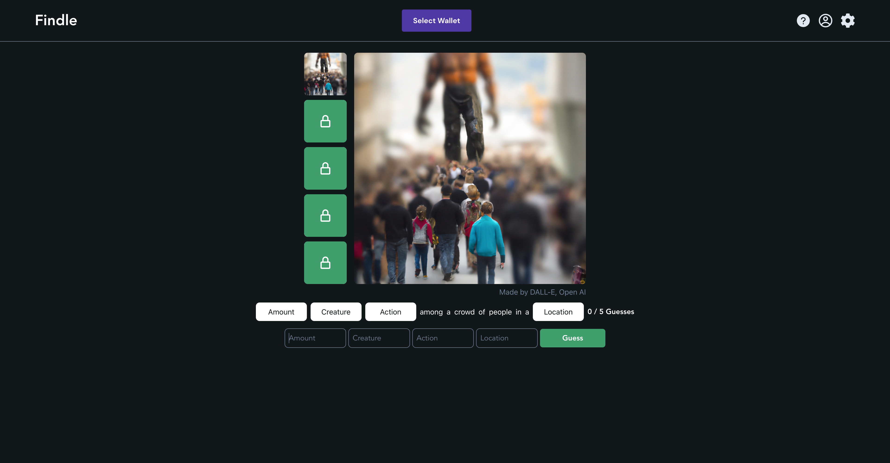
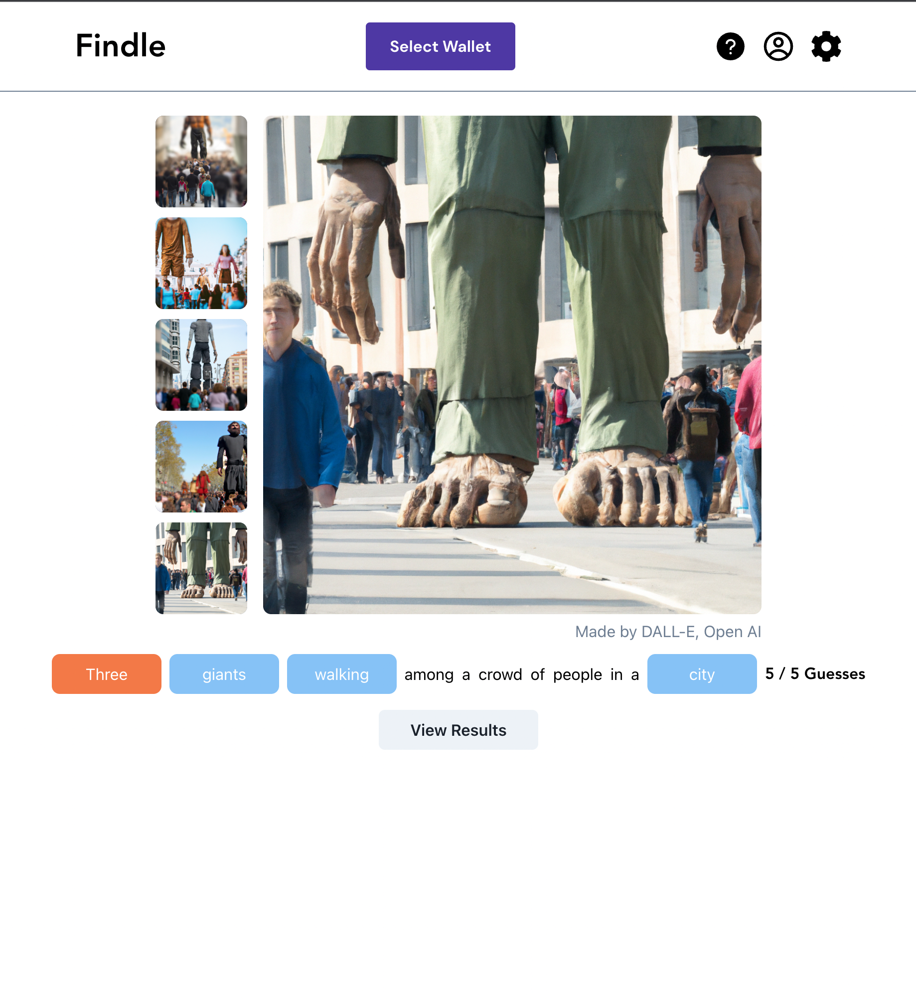

# [Findle](https://findle.live)

A fun daily game! Guess the prompt of a series of AI generated images and mint your unique NFT on the Solana Blockchain.

Visit [findle.live](https://findle.live) to play

## Take A Look

  
  

## The Tech Stack

[TypeScript](https://www.typescriptlang.org/) was used throughout this project.

<strong>FRONTEND:</strong>

- [React](https://reactjs.org/) - Frontend library
- [Chakra UI](https://chakra-ui.com/) - modular component library with prebuilt react components
- [DALLE-2](https://openai.com/dall-e-2/) - API for AI generated images
- [Cloudinary](https://cloudinary.com) - Image storage and management
- [Cypress](https://www.cypress.io/) - End-to-end testing

<strong>BACKEND:</strong>

- [Firebase Authentication](https://firebase.google.com/) - Google sign in and authentication
- [Firebase Cloud Firestore](https://firebase.google.com/) - Non-relational database
- [Firebase Cloud Functions](https://firebase.google.com/) - Serverless functions
- [Firebase Hosting](https://firebase.google.com/) - Deployment

## The Team

- Che Theaker - [GitHub](https://github.com/chetheaker) - [LinkedIn](https://linkedin.com/in/chetheaker)
- Adam Hallberg - [GitHub](https://github.com/Adam-github-acc) - [LinkedIn](https://www.linkedin.com/in/adamhallberg/)
- René Beltrán - [GitHub](https://github.com/renebeltranr) - [LinkedIn]()
- Alex Colls - [GitHub](https://github.com/quantium-rock) - [LinkedIn](https://www.linkedin.com/in/alex-colls-outumuro/)
